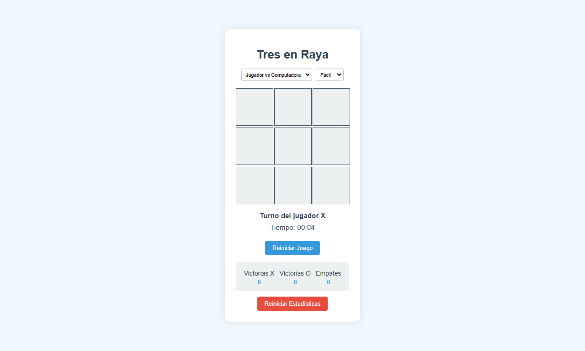

# Tres en Raya

  

Un juego clásico de Tres en Raya implementado con HTML, CSS y JavaScript puro. Juega contra un amigo y lleva un registro de tus victorias.

## 🚀 Demo

Puedes jugar al juego en vivo aquí: [Demo del Tres en Raya](https://tres-en-raya-bqto.s3.sa-east-1.amazonaws.com/index.html)

## ✨ Características

- 🎮 Juego para dos jugadores
- ⏱️ Contador de tiempo por partida
- 📊 Estadísticas de juego (victorias X, victorias O, empates)
- 🔄 Reinicio de juego y estadísticas
- 🏆 Animación de línea de victoria
- 📱 Diseño responsivo

## 🛠️ Tecnologías

- HTML5
- CSS3
- JavaScript (ES6+)

## 🏁 Empezando

### Prerrequisitos

- Un navegador web moderno

### 🎮 Cómo jugar

1. Abre el archivo `index.html` en tu navegador web.
2. El juego comienza con el jugador X. Haz clic en cualquier celda vacía para hacer tu movimiento.
3. Los jugadores se alternan entre X y O.
4. El juego termina cuando un jugador consigue tres de sus símbolos en línea (horizontal, vertical o diagonal) o cuando todas las celdas están llenas sin un ganador (empate).
5. Usa el botón "Reiniciar Juego" para comenzar una nueva partida.
6. Usa el botón "Reiniciar Todo" para poner a cero todas las estadísticas.

## 📱 Estructura del proyecto

- `index.html`: La estructura HTML del juego.
- `styles.css`: Estilos CSS para la apariencia del juego.
- `script.js`: La lógica del juego en JavaScript.
- `README.md`: Este archivo.

## Cómo contribuir

Si quieres contribuir con este proyecto, puedes:

1. Crear un nuevo asunto (issue) [https://github.com/ejavierds/Tres-en-Raya-Clasico/issues](https://github.com/ejavierds/Tres-en-Raya-Clasico/issues)
2. Generar un fork del repositorio [https://github.com/ejavierds/Tres-en-Raya-Clasico/forks](https://github.com/ejavierds/Tres-en-Raya-Clasico/forks)
3. Crear una nueva rama [https://github.com/ejavierds/Tres-en-Raya-Clasico/branches](https://github.com/ejavierds/Tres-en-Raya-Clasico/branches)
4. Abrir un pull request [https://github.com/ejavierds/Tres-en-Raya-Clasico/pulls](https://github.com/ejavierds/Tres-en-Raya-Clasico/pulls)

## Licencia

Distribuido bajo la Licencia Creative Commons (CC BY-NC-ND). Ver [LICENSE](https://descargas.intef.es/cedec/proyectoedia/guias/contenidos/guiasoftwarelibre/licencias_para_compartir.html) para más información.

## Contacto

Edery Javier Rodríguez Alvarado (@ejavierds) - [ederyrodriguez@gmail.com](mailto:ederyrodriguez@gmail.com)

Enlace del proyecto: [https://github.com/ejavierds/Tres-en-Raya-Clasico](https://github.com/ejavierds/Tres-en-Raya-Clasico)
